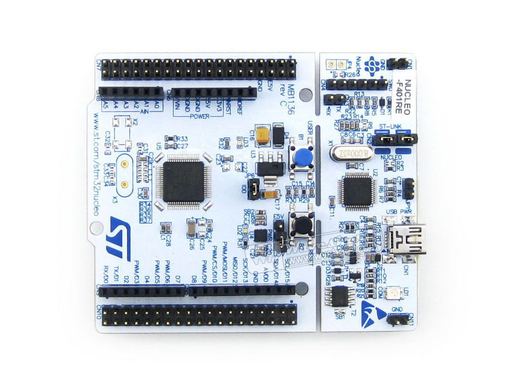

## Microcontroller STM32F4
Microcontroller STM32F4 is one of the most popular microcontroller. 
<kbd></kbd>

Software STM32F4 was developed using platform: mbed.com.

Targets of STM32F4 are:
- connection with dust sensor PMS1003:
  * receiving data measurement: concentrations of PM2.5/PM10
  * controlling sensor fan operation
- connection with multi-fuctonal sensor BME280:
  * receiving data measurement: air temperature, atmospheric pressure and relative air humidity
- connection with display OLED:
  * showing current time and date (if time and date are setting)
  * showing data measurement: concentrations of PM2.5/PM10, air temperature, atmospheric pressure and relative air humidity
  * showing configuration settings: the time measurement, the numbers of measurement, the break between measurement
  * showing information about device status: 
    - ALL OK
    - NO WIFI
    - NO SD CARD
- connection with LED: 
  * changing the color of LED to show device status: 
    - configuration - white
    - ALL OK - green
    - NO WIFI - blue
    - NO SD CARD or another error - red
- connection with microcontroller ESP8266:
  * exchanging data between microcontrollers:
      - from ESP8266 to STM32F4 - exchanging configuration data and current time and date
      - from STM32F4 to ESP8266 - exchanging data measurement
